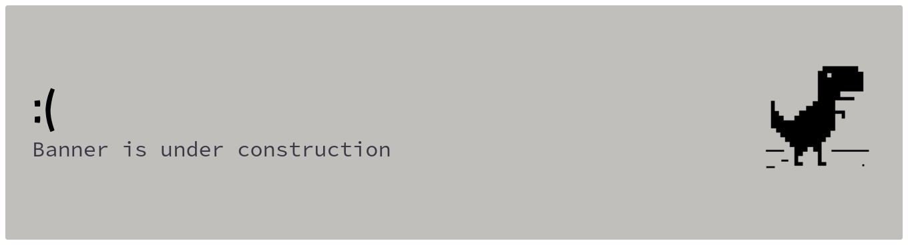

<div align="center">



</div>

---

## about me

```json
{
  "handle": "rokuroo171",
  "started_with": ["Scratch", "Python"],
  "builds": "things I need, then wonders why I needed them"
}
```

---

## ~~fastfetch~~ rokufetch

```
$ gh rokufetch
    .--.              rokuroo@github
   |o_o |             --------------
   |:_/ |             distro:  NixOS, CachyOS
  //   \ \            wm:      Hyprland
 (|     | )           editor:  VSCodium + Neovim
/'\_   _/`\           shell:   gh
\___)=(___/           from:    Indonesia
                      uptime:  since 2022 (experience)
                      now playing: 2am playlist
```

---

## tech stack

<div align="center">


</div>

---

## projects

```
$ gh repo list rokuroo171 --limit 3
```

| repo | about | ⭐ |
|------|-------|---|
| [glean](https://github.com/rokuroo171/glean) | open-source note-taking app with lots of customization, built with wails (go + react) | 22 |
| [raind](https://github.com/rokuroo171/raind) | terminal weather screensaver written in go | 6 |
| [sunder](https://github.com/rokuroo171/sunder) | C2 framework | 0 |

---

## learning

```
$ nix profile list | grep learning

learning.rust   "the borrow checker and i are getting to know each other"
```

---

## stats

<div align="center">


</div>

<div align="center">


</div>

<div align="center">



</div>

---

## favourites

```
$ tree ~/favourites
favourites
├── games
│   ├── a-space-for-the-unbound
│   ├── omori
│   ├── undertale
│   ├── limbus-company
│   ├── wuthering-waves      # carlotta.
│   └── punishing-gray-raven
├── anime
│   ├── bocchi-the-rock
│   ├── violet-evergarden
│   ├── k-on
│   └── vinland-saga
└── music
    └── anything that hits different at 2am :0
```

---

## contact

<div align="center">

[](https://github.com/rokuroo171)
[](https://instagram.com/rakka.tar.xz)
[](https://open.spotify.com/user/31ugw36sbsvnbk77pcv4wf5pvxfm)
[](https://anilist.co/user/rokuroo171/)
[](https://www.linkedin.com/in/m-rakka-0175683b4)

</div>

---

<div align="center">

<sub><i>Hi rokuroo171! You've successfully authenticated, but GitHub does not provide shell access.</i><br/><i>Connection to github closed.</i></sub>

</div>
